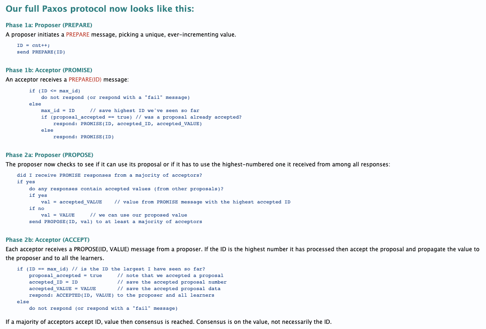

# Java Paxos Server

This project implements a Java threaded and **distributed** **gRPC** key-value server application with **two-phase protocol(2PC)**. You can run as many servers as you want and 2PC will ensure all server have the same data and update/abort changes in the same time. 

 
### Paxos

_Paxos is an algorithm that is used to achieve consensus among a distributed set of computers that communicate via an asynchronous network._

reference: https://people.cs.rutgers.edu/~pxk/417/notes/paxos.html

### How to run this application

I use **Java 8 & IntelliJ** for this project

- clone this project and run maven with `pom.xml` for gRPC dependencies.
- Run `src/Coordinator/Main`
- Run `src/Server/Main`. Run as many as servers you want

​	if you are using IDEA, you can right click the file and `edit run configuration` and choose `Allow multiple instances`

- Run the `client/Main` to send put/delete request  

The client will send 5 put & 5 delete to coordinator, all server you running will keep up with those updates in the same time.

### Run with Jar file

Find the Jar file of coordinator, server and client. Allow parallel run of server, and then run coordinator, server (you can run multiple instances) and finally client.

### Project Structure

`client`: Client who sends put/delete request to server

`gRPC`: folder for gRPC self-generated code

`proto`: folder for `.proto` file

`src/Coordinator`: Provide coordinator and expose gRPC service

`src/Server`: servers which keeps the map

`shared`: Log, and Message class for server and coordinator

If everything go as expected you can see something like this:

### Two-Phase protocol

Two-phase protocol (2PC) is a type of atomic commitment protocol (ACP). It is a distributed algorithm that coordinates all the processes that participate in a distributed atomic transaction on whether to commit or abort (roll back) the transaction.

In this application, I use 2PC between coordinator and server to make keep all servers have equauivalent map.

As the coordinator receive the put/delete request, it will sends `"VOTE_REQUEST"` to all connected servers and then recording the response. 

The server will response with `"VOTE_COMMIT"` to coordinator when its available. Otherwise, it will sends `"VOTE_ABORT"`

If coordinator receive all of the   `"VOTE_COMMIT"` from servers, it will then sends `"GLOBAL_COMMIT"` to servers and the server could commit the change by put&delete request.

Otherwise, the server will response with `"GLOBAL_ABORT"`

### gRPC

gRPC is a RPC framework. Here, the client will use gRPC to invoke put & delete request with servers and coordinators.

### Todo

- move the get/delete request service to server instead of coordinator 

https://people.cs.rutgers.edu/~pxk/417/notes/paxos.html
